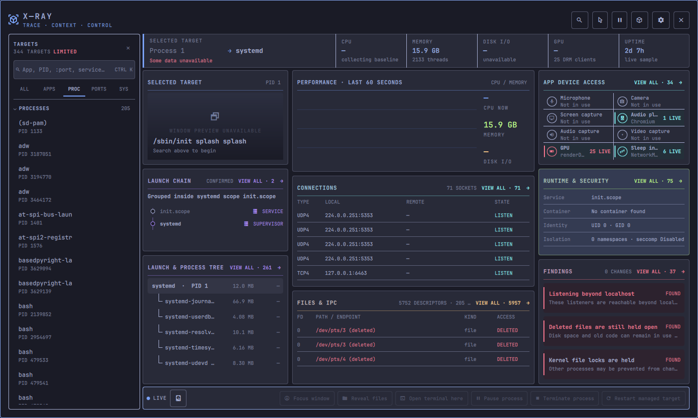

# Omarchy X-Ray

A live system inspector for the Omarchy bar.

Trace a window, process, service, container, port, file, or device to the exact
process behind it—then see how it started, what it is using, and the actions you
can take in one focused view.

<p align="center">
  
</p>

Search for an app, choose a window, or enter a PID, port, file, service,
container, or device. X-Ray follows it to the exact process and brings together
its process tree, performance, connections, open files, device use, and runtime
details.

## Install

```bash
omarchy plugin add https://github.com/RandaZraik/omarchy-xray --enable
```

Click the X-Ray icon in the Omarchy bar and choose what to inspect:

| Target | Example |
| --- | --- |
| Running application | `ghostty` |
| Process | `4242` or `pid:4242` |
| systemd service or scope | `service:user:demo.service` |
| Docker, Podman, or nerdctl container | `container:docker:postgres` |
| Listening or connected port | `:5173` |
| Open file | `/path/to/file` |
| Device activity | `microphone`, `camera`, `audio`, or `gpu` |
| Window | Use the window picker |

## Features

- Finds the exact process tree behind the selected target.
- Opens the tree as a searchable evidence table with full redacted commands,
  PID, user, state, threads, memory, total-capacity CPU, and disk read/write rates.
  Keep lineage order or sort and reverse by CPU, memory, disk activity, and
  individual columns.
- Keeps open apps, processes, ports, and system targets in a searchable side
  browser, so you can inspect several matches without rebuilding the search.
- Shows how it started through sessions, shells, systemd units,
  supervisors, and containers.
- Shows CPU, memory, disk activity, connections, files, locks, devices, and
  runtime security together.
- Links noteworthy activity to its source and the next useful check.
- Optionally captures a private local preview of the selected window.
- Opens complete lists in focused drawers while keeping the important details
  on one screen.
- Focuses windows, reveals files, opens a terminal in context, and can pause,
  resume, or terminate same-user processes. It can also restart targets owned
  by a user service or supported container runtime. Terminate and restart
  require confirmation, and every process action rechecks identity first.
- Exports private `.xray.zip` reports for offline inspection and comparison.

## Controls

- `Ctrl+K` — choose another target
- `Ctrl+R` — refresh now
- `Esc` — close the topmost target browser, drawer, confirmation, or X-Ray
- Click a process — inspect that process and its subtree
- Click `VIEW ALL` in a card — open the complete list

X-Ray settings control the refresh interval, timeline window, and optional
window preview. X-Ray works with partial system capabilities and clearly labels
information it could not read.

## Privacy

X-Ray runs locally, has no analytics, and never requests elevated privileges.
Environment variable names may be shown, but their values are never retained,
displayed, or exported.
Optional window previews stay in a private temporary directory and are excluded
from exported reports. Reports are redacted before export or copy.

Omarchy's standard tools provide more detail when available, including
`hyprctl`, `grim`, `slurp`, `pw-dump`, `journalctl`, `systemctl`, container
runtimes, and `systemd-inhibit`.

## Update or remove

```bash
omarchy plugin update io.github.randazraik.xray
omarchy plugin remove io.github.randazraik.xray
```
